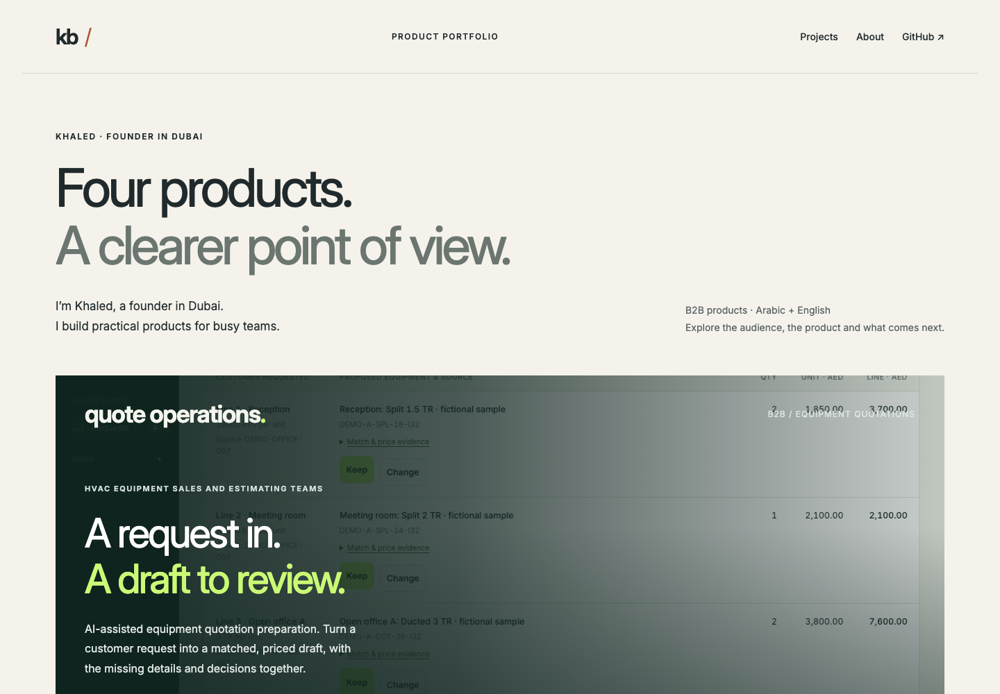

# Khaled / Product portfolio

Canonical public home: **[kbartawi.github.io](https://kbartawi.github.io/)**.

## Edit and build

Requires Node.js 20 or newer; there are no package dependencies.

1. Edit `content/projects.json` for copy, stages, updates and public links.
2. Run `npm run build`.
3. Preview with `python3 -m http.server 4177 --directory docs` and open `http://localhost:4177`.
4. Commit source and generated `docs/` together.

The build writes the homepage, four project profiles, sitemap, metadata and a 404 page into `docs/`. Shared fonts, CSS and selected visual assets also live there. `docs/.nojekyll` ensures GitHub Pages serves the static files directly. Set `PORTFOLIO_SITE_URL` when intentionally moving to another origin.

## Publish

Use the public repository `Kbartawi/Kbartawi.github.io`. In Settings → Pages, select **Deploy from a branch**, branch **main**, folder **/docs**. The personal GitHub profile can link to this home once publication is verified.

Quote Operations presents the current AI-assisted preparation workflow, with a current fictional quotation screenshot and links to the product website, narrated demo and public sample. Its copy distinguishes pasted email/WhatsApp requests from direct channel integrations, and keeps engineering and commercial review explicit. Oris links to its public product website. Manzl and Aqd have profiles without demo buttons because their demos are not publicly available. This repository contains only the curated public portfolio, not private product applications or review workspaces.

## Current Quote Operations update · 9 September 2026

The featured profile explains the actual workflow: add an English or Arabic request, review a prepared catalogue/pricing draft, resolve exceptions and request approval. Public demonstrations use fictional data. Company catalogue onboarding, integrations and customer ROI remain pilot work.

Product: [quote-operations.vercel.app](https://quote-operations.vercel.app/) · [Watch the workflow](https://quote-operations.vercel.app/#qs-demo) · [Try the prepared sample](https://quote-operations.vercel.app/workspace?demo=review).
